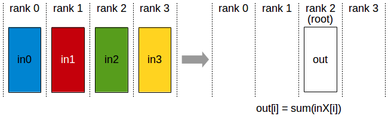
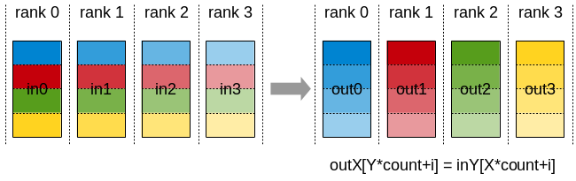
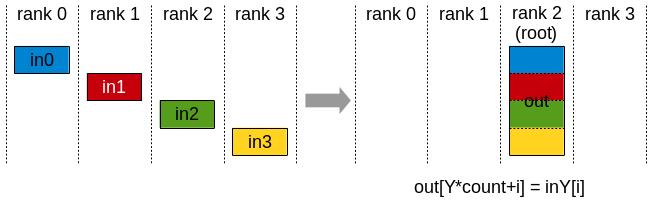
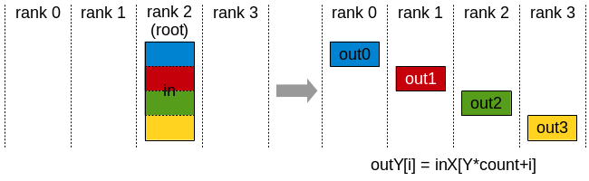

# Collective Operations

Collective operations have to be called for each rank (hence CUDA device), using the same count and the same datatype, to form a complete collective operation.
Failure to do so will result in undefined behavior, including hangs, crashes, or data corruption.

## AllReduce

The AllReduce operation performs reductions on data (for example, sum, min, max) across devices and stores the result in the receive buffer of every rank.

In a *sum* allreduce operation between *k* ranks, each rank will provide an array in of N values, and receive identical results in array out of N values,
where out[i] = in0[i]+in1[i]+…+in(k-1)[i].

Related links: [`ncclAllReduce()`](../api/colls.md#c.ncclAllReduce).

## Broadcast

The Broadcast operation copies an N-element buffer from the root rank to all the ranks.

Important note: The root argument is one of the ranks, not a device number, and is therefore impacted by a different rank to device mapping.

Related links: [`ncclBroadcast()`](../api/colls.md#c.ncclBroadcast).

## Reduce

The Reduce operation performs the same operation as AllReduce, but stores the result only in the receive buffer of a specified root rank.

Important note: The root argument is one of the ranks (not a device number), and is therefore impacted by a different rank to device mapping.

Note: A Reduce, followed by a Broadcast, is equivalent to the AllReduce operation.

Related links: [`ncclReduce()`](../api/colls.md#c.ncclReduce).

## AllGather

The AllGather operation gathers N values from k ranks into an output buffer of size k\*N, and distributes that result to all ranks.

The output is ordered by the rank index. The AllGather operation is therefore impacted by a different rank to device mapping.

Note: Executing ReduceScatter, followed by AllGather, is equivalent to the AllReduce operation.

Related links: [`ncclAllGather()`](../api/colls.md#c.ncclAllGather).

## ReduceScatter

The ReduceScatter operation performs the same operation as Reduce, except that the result is scattered in equal-sized blocks between ranks,
each rank getting a chunk of data based on its rank index.

The ReduceScatter operation is impacted by a different rank to device mapping since the ranks determine the data layout.

Related links: [`ncclReduceScatter()`](../api/colls.md#c.ncclReduceScatter)

## AlltoAll

In an AlltoAll operation between k ranks, each rank provides an input buffer of size k\*N values, where the j-th chunk of N values is sent to destination rank j. Each rank receives an output buffer of size k\*N values, where the i-th chunk of N values comes from source rank i.

Related links: [`ncclAlltoAll()`](../api/colls.md#c.ncclAlltoAll).

## Gather

The Gather operation gathers N values from k ranks into an output buffer on the root rank of size k\*N.

Important note: The root argument is one of the ranks, not a device number, and is therefore impacted by a different rank to device mapping.

Related links: [`ncclGather()`](../api/colls.md#c.ncclGather).

## Scatter

The Scatter operation distributes a total of N\*k values from the root rank to k ranks, each rank receiving N values.

Important note: The root argument is one of the ranks, not a device number, and is therefore impacted by a different rank to device mapping.

Related links: [`ncclScatter()`](../api/colls.md#c.ncclScatter).
