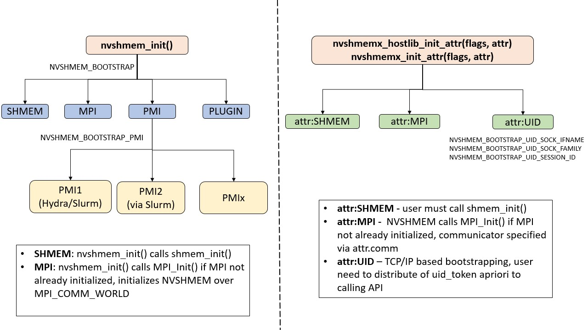

# Library Setup, Exit, and Query

The library setup and query interfaces that initialize and monitor the parallel environment of the PEs.

## **NVSHMEM_INIT**

`void nvshmem_init ( void )`

**Description**

`nvshmem_init` allocates and initializes resources used by the NVSHMEM library. It is a collective operation that all PEs must call before any other NVSHMEM routine may be called. Multiple calls to `nvshmem_init` are allowed, and must be called by the same set of processes as the initial initial call to `nvshmem_init`. At the end of the NVSHMEM program which it initialized, each call to `nvshmem_init` must be matched with a call to `nvshmem_finalize`. If NVSHMEM fails to initialize, the program will exit with a non-zero value.

**Returns**

None.

The following `nvshmem_init` example is for _C_ programs: example_code/shmem_init_example.c

## **NVSHMEMX_INIT_ATTR**

`int nvshmemx_init_attr ( unsigned int flags , nvshmemx_init_attr_t *attributes )`

_flags [IN]_
    Bitwise OR of operation flags. A value of 0 indicates an initialization that is similar to when `nvshmem_init` is used.
_attributes [IN]_
    Additional attributes to be used when initializing the NVSHMEM library.

**Description**

NVSHMEM provides the `nvshmem_init` function, as defined in the OpenSHMEM 1.3 specification. In addition, the `nvshmemx_init_attr` function is provided to support the easy porting of MPI and OpenSHMEM programs to NVSHMEM. It also provides support for launcher agnostic bootstrapping, as described below. It allows the initialization of NVSHMEM based on an existing MPI communicator or OpenSHMEM job. This is useful when an application is written to use NVSHMEM in a node and MPI across nodes, or when an application uses another OpenSHMEM implementation to manage communication across a symmetric heap in the system memory. It allows the initialization of NVSHMEM based on a Unique Identifier (UID) that utilizes IP-based networking. This removes a dependency on a specific job launch mechanism and instead uses IP-based networking directly to bootstrap the NVSHMEM application. UID initialization is useful in applications that require portable application startup without dependency on process management infrastructure. However, it does require applications to distribute a UID token prior to calling the NVSHMEM initialization function.

Multi-modal initialization of NVSHMEM runtime using MPI, OpenSHMEM and UID bootstraps

The `nvshmemx_init_attr` function initializes the NVSHMEM library by allocating the resources that are used by the library and assigning a unique identifier to each PE. This collective operation should be called by all PEs before any other NVSHMEM routine.

The _flags_ argument can be set to 0 or one of the following values:

>   * _NVSHMEMX_INIT_WITH_MPI_COMM_ \- This flag is used to specify that an MPI communicator is provided by the user.
>   * _NVSHMEMX_INIT_WITH_SHMEM_ \- This flag is used to specify that NVSHMEM is used inside an OpenSHMEM job.
>   * _NVSHMEMX_INIT_WITH_UNIQUEID_ \- This flag is used to specify that Unique ID arguments are provided by the user.
>

With the `NVSHMEMX_INIT_WITH_MPI_COMM` option, the NVSHMEM library is initialized based on the MPI communicator that is provided with each rank in the MPI communicator that participates as an NVSHMEM PE. A call to `nvshmem_finalize` is required before the MPI communicator is destroyed.

**Note** : Do not make any calls to NVSHMEM routines after the MPI communicator has been destroyed.

With the `NVSHMEMX_INIT_WITH_SHMEM` option, the NVSHMEM library is initialized based on the OpenSHMEM PE underlying each NVSHMEM PE. A call to `nvshmem_finalize` is required before `shmem_finalize` is called. Do not make any calls to NVSHMEM routines after `nvshmem_finalize` is called.

With the `NVSHMEMX_INIT_WITH_UNIQUEID` option, the NVSHMEM library is initialized based on the Unique ID arguments that are provided by each PE in its attribute argument.

The attributes argument is a pointer to a structure type that contains the following fields:

_int version_
    A scalar representing the version of the struct. Filled out by the `NVSHMEMX_INIT_ATTR_INITIALIZER` macro This is not to be modified directly.
_void *mpi_comm_
    A pointer to the MPI communicator handle that will be used as the NVSHMEM world team.
_nvshmemx_init_args_t init_args_
    A union of initializer arguments per bootstrap, including Unique ID arguments.

It is recommended, but not necessary to statically initialize the attribute struct using the `NVSHMEMX_INIT_ATTR_INITIALIZER` macro befor calling this function. The optional nature of the initializer may change in future major releases.

**Returns**

Returns 0 on success or an error code on failure.

**Example**

See Attribute-Based Initialization Example.

## **NVSHMEMX_HOSTLIB_INIT_ATTR**

`int nvshmemx_hostlib_init_attr ( unsigned int flags , nvshmemx_init_attr_t *attributes )`

_flags [IN]_
    Bitwise OR of operation flags. A value of 0 indicates an initialization that is similar to when `nvshmem_init` is used.
_attributes [IN]_
    Additional attributes to be used when initializing the NVSHMEM library.

**Description**

The `nvshmemx_hostlib_init_attr` function differs from the `nvshmemx_init_attr` function in three ways:

  * This API only initializes the host library, enabling both host, and on-stream APIs. This function allows applications to not statically link `libnvshmem.a`. Applications can dynamically load the host library (using `dlopen`) to enable host and on-stream APIs. Device APIs can be used through cubins initialized by the `nvshmemx_cumodule_init` API.
  * It is REQUIRED that the `init_attr` struct be initialized with the `NVSHMEMX_INIT_ATTR_INITIALIZER` macro before calling this API. Not doing so will result in undefined behavior.
  * Calls to this API must be paired with a call to `nvshmemx_hostlib_finalize`. Pairing calls to this API with `nvshmem_finalize` will lead to undefined behavior.

Calls to `nvshmemx_hostlib_init_attr` may be freely composed with calls to other library initialization APIs within the same program. This is useful to libraries which may be dynamically linked by an application which may also call any other initialization API. All initialization APIs within the same program must be called by the same number of processes.

Refer to the documentation of `nvshmemx_init_attr` for additional information on the functionality of this API.

## **NVSHMEMX_HOSTLIB_FINALIZE**

`void nvshmemx_hostlib_finalize ( )`

**Description**

The `nvshmemx_hostlib_finalize` function differs from the `nvshmem_finalize` function such that it only finalizes the host library, disabling both host, and on-stream APIs. Applications can dynamically unload the host library (using `dlclose`) to disable host and on-stream APIs. Device APIs can be unloaded through cubins finalized by the `nvshmemx_cumodule_finalize` API as long as it is invoked before `nvshmemx_hostlib_finalize`, for example, the following order of invoking the APIs `nvshmemx_hostlib_init_attr`, `nvshmemx_cumodule_init`, `nvshmemx_hostlib_finalize`, `nvshmemx_cumodule_finalize` can lead to undefined behavior.

Refer to the documentation of `nvshmem_finalize` for additional information on the functionality of this API.

## **NVSHMEMX_GET_UNIQUE_ID**

`int nvshmemx_get_uniqueid ( nvshmemx_uniqueid_t *id )`

_id [OUT]_
    A pointer to the Unique ID object to be populated by the NVSHMEM runtime. The object must be initialized with the NVSHMEMX_UNIQUEID_INITIALIZER prior to calling this function.

**Description**

This method queries the Unique ID (UID); stores it in an opaque, serializable structure; and returns its content to the user. The value of this structure will be consumed by `nvshmemx_init_attr` and must be set using the `nvshmemx_set_attr_uniqueid_args` function, as described below.

**Returns**

Returns 0 on success, nonzero otherwise.

See Attribute-Based Initialization Example.

## **NVSHMEMX_SET_ATTR_UNIQUEID_ARGS**

`void nvshmemx_set_attr_uniqueid_args ( int rank , int nranks , nvshmemx_uniqueid_t *id , nvshmemx_init_attr_t *attr )`

_rank [IN]_
    My PE identifier in the job
_nranks [IN]_
    Total number of PEs in the job
_id [IN]_
    A pointer to the Network Socket Unique ID, retrieved using prior `nvshmemx_get_uniqueid` call
_attr [OUT]_
    A pointer to the NVSHMEM initialization attribute structure of type `nvshmemx_init_attr_t`

**Description**

This method provides the convenience functionality to set or populate Unique ID initialization specific arguments of the `nvshmemx_init_attr_t` structure. The `nvshmemx_init_attr_t` structure must be statically initialized using the `NVSHMEMX_INIT_ATTR_INITIALIZER` macro before calling this function.

**Returns**

None

**Example**

See Attribute-Based Initialization Example.

## **NVSHMEMX_CUMODULE_INIT**

`int nvshmemx_cumodule_init ( CUmodule module )`

_module [IN]_
    CUDA module to initialize for use with NVSHMEM.

**Description**

The `nvshmemx_cumodule_init` function intializes the device state in `module` so that it’s able to perform NVSHMEM operations. The NVSHMEM library must have completed device initialization prior to calling this function. See nvshmemx_init_status for additional information on determining when device initialization has completed.

**Returns**

Returns 0 on success or an error code on failure.

## **NVSHMEMX_INIT_STATUS**

`int nvshmemx_init_status ( void )`

**Description**

The `nvshmemx_init_status` function can be used to check if the NVSHMEM library is currently initialized and ready to perform NVSHMEM operations.

NVSHMEM initialization is performed in two phases: bootstrapping and device initialization. If the CUDA device has not been set prior to calling an NVSHMEM initialization routine, NVSHMEM will perform only bootstrapping and delay device initialization until a subsequent collective operation is performed (i.e. `nvshmem_malloc`, `nvshmem_calloc`, `nvshmem_align`, `nvshmem_barrier_all`, `nvshmem_sync_all`, `nvshmemx_barrier_all_on_stream`, or `nvshmemx_sync_all_on_stream`). Similarly, when `nvshmem_finalize` is called, the NVSHMEM library will finalize the NVSHMEM state associated with the CUDA device and return to the bootstrapped state.

When NVSHMEM is in the bootstrapped mode, PE query routines can be used to assist with CUDA device selection (e.g. `nvshmem_my_pe`, `nvshmem_n_pes`, `nvshmemx_team_my_pe(NVSHMEMX_TEAM_NODE)`, `nvshmemx_team_n_pes(NVSHMEMX_TEAM_NODE)`). The CUDA device must be set prior to performing any other NVSHMEM operations, as they will trigger NVSHMEM to perform device initialization. No device functions (including PE query) can be performed until NVSHMEM has completed device initialization.

When the application consists of multiple dynamically linked components that each use NVSHMEM, the call to `nvshmemx_init_status` will indicate the status of the calling component. For example, consider an NVSHMEM application links with `libfoo.so`, which also uses NVSHMEM. When the application has fully initialized NVSHMEM the `nvshmemx_init_status` call from the application’s code might return `NVSHMEM_STATUS_IS_INITIALIZED`. However, if `libfoo.so` calls `nvshmemx_init_status` prior to performing initialization it would see `NVSHMEM_IS_BOOTSTRAPPED` because the device state of `libfoo.so` has not yet been initialized.

**Returns**

One of the following constants is returned. These constants have increasing values in the order shown and `NVSHMEM_STATUS_NOT_INITIALIZED` has the value `0`.

  0. `NVSHMEM_STATUS_NOT_INITIALIZED` – NVSHMEM has not been initialized.
  1. `NVSHMEM_STATUS_IS_BOOTSTRAPPED` – NVSHMEM is bootstrapped, but has not completed device initialization.
  2. `NVSHMEM_STATUS_IS_INITIALIZED` – NVSHMEM has completed device initialization and the PE has exclusive use of the assigned CUDA device.
  3. `NVSHMEM_STATUS_LIMITED_MPG` – NVSHMEM has completed device initialization and the PE has limited, shared used of the assigned CUDA device. See Multiprocess GPU Support for more information.
  4. `NVSHMEM_STATUS_FULL_MPG` – NVSHMEM has completed device initialization and the PE has full, shared used of the assigned CUDA device. See Multiprocess GPU Support for more information.

## **NVSHMEM_MY_PE**

`int nvshmem_my_pe ( void )`

`__device__ int nvshmem_my_pe ( void )`

**Description**

This routine returns the PE number of the calling PE. It accepts no arguments. The result is an integer between `0` and `npes` \- `1`, where `npes` is the total number of PEs executing the current program.

**Returns**

Integer - Between `0` and `npes` \- `1`

## **NVSHMEM_N_PES**

`int nvshmem_n_pes ( void )`

`__device__ int nvshmem_n_pes ( void )`

**Description**

The routine returns the number of PEs running in the program.

**Returns**

Integer - Number of PEs running in the NVSHMEM program.

The following `nvshmem_my_pe` and `nvshmem_n_pes` example is for _C/C++_ programs: ./example_code/shmem_npes_example.c

## **NVSHMEM_FINALIZE**

`void nvshmem_finalize ( void )`

**Description**

`nvshmem_finalize` is a collective operation that ends the NVSHMEM portion of a program previously initialized by `nvshmem_init` or `nvshmem_init_thread` and releases all resources used by the NVSHMEM library. This collective operation requires all PEs to participate in the call. There is an implicit global barrier in `nvshmem_finalize` to ensure that pending communications are completed and that no resources are released until all PEs have entered `nvshmem_finalize`. `nvshmem_finalize` must be the last NVSHMEM library call encountered in the NVSHMEM portion of a program. A call to `nvshmem_finalize` will release all resources initialized by a corresponding call to `nvshmem_init` or `nvshmem_init_thread`. All processes that represent the PEs will still exist after the call to `nvshmem_finalize` returns, but they will no longer have access to resources that have been released.

**Returns**

None.

**Notes**

`nvshmem_finalize` releases all resources used by the NVSHMEM library including the symmetric memory heap and pointers initiated by `nvshmem_ptr`. This collective operation requires all PEs to participate in the call, not just a subset of the PEs. The non-NVSHMEM portion of a program may continue after a call to `nvshmem_finalize` by all PEs.

The following finalize example is for _C_ programs: ./example_code/shmem_finalize_example.c

## **NVSHMEM_GLOBAL_EXIT**

`void nvshmem_global_exit ( int status )`

`__device__ void nvshmem_global_exit ( int status )`

_status [IN]_
    The exit status from the main program.

**Description**

`nvshmem_global_exit` is a non-collective routine that allows any one PE to force termination of an NVSHMEM program for all PEs, passing an exit status to the execution environment. This routine terminates the entire program, not just the NVSHMEM portion. When any PE calls `nvshmem_global_exit`, it results in the immediate notification to all PEs to terminate. `nvshmem_global_exit` flushes I/O and releases resources in accordance with _C/C++_ language requirements for normal program termination. If more than one PE calls `nvshmem_global_exit`, then the exit status returned to the environment shall be one of the values passed to `nvshmem_global_exit` as the status argument. There is no return to the caller of `nvshmem_global_exit`; control is returned from the NVSHMEM program to the execution environment for all PEs.

**Returns**

None.

**Notes**

`nvshmem_global_exit` may be used in situations where one or more PEs have determined that the program has completed and/or should terminate early. Accordingly, the integer status argument can be used to pass any information about the nature of the exit; e.g., that the program encountered an error or found a solution. Since `nvshmem_global_exit` is a non-collective routine, there is no implied synchronization, and all PEs must terminate regardless of their current execution state. While I/O must be flushed for standard language I/O calls from _C/C++_ , it is implementation dependent as to how I/O done by other means (e.g., third party I/O libraries) is handled. Similarly, resources are released according to _C/C++_ standard language requirements, but this may not include all resources allocated for the NVSHMEM program. However, a quality implementation will make a best effort to flush all I/O and clean up all resources.

## **NVSHMEM_PTR**

`void * nvshmem_ptr ( const void *dest , int pe )`

`__device__ void * nvshmem_ptr ( const void *dest , int pe )`

_dest [IN]_
    The symmetric address of the remotely accessible data object to be referenced.
_pe [IN]_
    An integer that indicates the PE number on which `dest` is to be accessed.

**Description**

`nvshmem_ptr` returns an address that may be used to directly reference `dest` on the specified PE. This address can be assigned to a pointer. After that, ordinary loads and stores to `dest` may be performed. The address returned by `nvshmem_ptr` is a local address to a remotely accessible data object. Providing this address to an argument of an NVSHMEM routine that requires a symmetric address results in undefined behavior.

The `nvshmem_ptr` routine can provide an efficient means to accomplish communication, for example when a sequence of reads and writes to a data object on a remote PE does not match the access pattern provided in an NVSHMEM data transfer routine like `nvshmem_put` or `nvshmem_iget`.

**Returns**

A local pointer to the remotely accessible `dest` data object is returned when it can be accessed using memory loads and stores. Otherwise, a null pointer is returned.

**Notes**

When calling `nvshmem_ptr`, `dest` is the address of the referenced symmetric data object on the calling PE.

In the following _C_ example, PE 0 uses the `nvshmem_ptr` routine to query a pointer and directly access the `dest` array on PE 1: ./example_code/shmem_ptr_example.c

## **NVSHMEMX_MC_PTR**

`void * nvshmemx_mc_ptr ( nvshmem_team_t team , void *dest )`

`__device__ inline void * nvshmemx_mc_ptr ( nvshmem_team_t team , void *dest )`

_team [IN]_
    A valid NVSHMEM team handle.
_dest [IN]_
    The symmetric address to be referenced.

**Returns**

A valid multicast address used to perform `multimem.*` PTX operations.

**Description**

This API returns a multicast address corresponding to the specified symmetric address and the team. The multicast address points to respective memory locations in the symmetric memory of PEs in the team that correspond to the local symmetric address passed as argument to the function. This address can be used to perform PTX `multimem.ld_reduce`, `multimem.st`, `multimem.red` operations exclusively, as demonstrated here . This capability is available in third-generation NVSwitch systems (NVLink4) with Hopper and later GPU architectures. On unsupported platforms, this API returns a `nullptr`. Providing this address to an argument of an NVSHMEM routine that requires a symmetric address results in undefined behavior.

`nvshmemx_mc_ptr` routine can provide a quick means to leverage NVSwitch based multicast and reduction offload features also referred to as NVLink SHARP.

## **NVSHMEM_INFO_GET_VERSION**

`void nvshmem_info_get_version ( int *major , int *minor )`

`__device__ void nvshmem_info_get_version ( int *major , int *minor )`

_major [OUT]_
    The major version of the OpenSHMEM Specification in use.
_minor [OUT]_
    The minor version of the OpenSHMEM Specification in use.

**Description**

This routine returns the major and minor version of the OpenSHMEM Specification in use. For a given library implementation, the major and minor version returned by these calls are consistent with the library constants `NVSHMEM_MAJOR_VERSION` and `NVSHMEM_MINOR_VERSION`.

**Returns**

None.

## **NVSHMEM_INFO_GET_NAME**

`void nvshmem_info_get_name ( char *name )`

`__device__ void nvshmem_info_get_name ( char *name )`

_name [OUT]_
    The vendor defined string.

**Description**

This routine returns the vendor defined name string of size defined by the library constant `NVSHMEM_MAX_NAME_LEN`. The program calling this function provides the `name` memory buffer of at least size `NVSHMEM_MAX_NAME_LEN`. The implementation copies the vendor defined string of size at most `NVSHMEM_MAX_NAME_LEN` to `name`. In _C/C++_ , the string is terminated by a null character. If the `name` memory buffer is provided with size less than `NVSHMEM_MAX_NAME_LEN`, behavior is undefined. For a given library implementation, the vendor string returned is consistent with the library constant `NVSHMEM_VENDOR_STRING`.

**Returns**

None.

## **NVSHMEMX_VENDOR_GET_VERSION_INFO**

`void nvshmemx_vendor_get_version_info ( int *major , int *minor , int *patch )`

`__device__ inline void nvshmemx_vendor_get_version_info ( int *major , int *minor , int *patch )`

_major [OUT]_
    The major version of the NVSHMEM in use.
_minor [OUT]_
    The minor version of the NVSHMEM in use.
_patch [OUT]_
    The patch version of the NVSHMEM in use.

**Description**

The `nvshmemx_vendor_get_version_info` function returns the NVSHMEM major, minor, patch version in use. For a given library implementation, the major, minor and patch version returned by these calls at runtime can be same or different from the constants `NVSHMEM_VENDOR_MAJOR_VERSION`, `NVSHMEM_VENDOR_MINOR_VERSION`, and `NVSHMEM_VENDOR_PATCH_VERSION` present at compile-time. The difference may arise, if an application links against version of the library at runtime, while compiling against a different version of the headers containing these constants.

**Returns**

None.

# Thread Support

This section specifies the interaction between the NVSHMEM interfaces and user threads. It also describes the routines that can be used for initializing and querying the thread environment. There are four levels of threading defined by the OpenSHMEM specification.

`NVSHMEM_THREAD_SINGLE`
    The NVSHMEM program must not be multithreaded.
`NVSHMEM_THREAD_FUNNELED`
    The NVSHMEM program may be multithreaded. However, the program must ensure that only the main thread invokes the NVSHMEM interfaces. The main thread is the thread that invokes either `nvshmem_init` or `nvshmem_init_thread`.
`NVSHMEM_THREAD_SERIALIZED`
    The NVSHMEM program may be multithreaded. However, the program must ensure that the NVSHMEM interfaces are not invoked concurrently by multiple threads.
`NVSHMEM_THREAD_MULTIPLE`
    The NVSHMEM program may be multithreaded and any thread may invoke the NVSHMEM interfaces.

The thread level constants must have increasing integer values; i.e., `NVSHMEM_THREAD_SINGLE` < `NVSHMEM_THREAD_FUNNELED` < `NVSHMEM_THREAD_SERIALIZED` < `NVSHMEM_THREAD_MULTIPLE`. The following semantics apply to the usage of these models:

  1. In the `NVSHMEM_THREAD_FUNNELED`, `NVSHMEM_THREAD_SERIALIZED`, and `NVSHMEM_THREAD_MULTIPLE` thread levels, the `nvshmem_init` and `nvshmem_finalize` calls must be invoked by the same thread.
  2. Any NVSHMEM operation initiated by a thread is considered an action of the PE as a whole. The symmetric heap and symmetric variables scope are not impacted by multiple threads invoking the NVSHMEM interfaces. Each PE has a symmetric heap that is shared by all threads within that PE. For example, a thread invoking a memory allocation routine such as `nvshmem_malloc` allocates memory that is accessible by all threads of the PE. The requirement that the same symmetric heap operations must be executed by all PEs in the same order also applies in a threaded environment. Similarly, the completion of collective operations is not impacted by multiple threads. For example, `nvshmem_barrier_all` is completed when all PEs enter and exit the `nvshmem_barrier_all` call, even though only one thread in the PE is participating in the collective call.
  3. Blocking NVSHMEM calls will only block the calling thread, allowing other threads, if available, to continue executing. The calling thread will be blocked until the event on which it is waiting occurs. Once the blocking call is completed, the thread is ready to continue execution. A blocked thread will not prevent progress of other threads on the same PE and will not prevent them from executing other NVSHMEM calls when the thread level permits. In addition, a blocked thread will not prevent the progress of NVSHMEM calls performed on other PEs.
  4. In the `NVSHMEM_THREAD_MULTIPLE` thread level, all NVSHMEM calls are thread-safe. That is, any two concurrently running threads may make NVSHMEM calls.
  5. In the `NVSHMEM_THREAD_SERIALIZED` and `NVSHMEM_THREAD_MULTIPLE` thread levels, if multiple threads call collective routines, including the symmetric heap management routines, it is the programmer’s responsibility to ensure the correct ordering of collective calls.
  6. NVSHMEM currently supports the `NVSHMEM_THREAD_SERIALIZED` threading level for host and stream APIs and `NVSHMEM_THREAD_MULTIPLE` for device APIs.

## **NVSHMEM_INIT_THREAD**

`int nvshmem_init_thread ( int requested , int *provided )`

_requested [IN]_
    The thread level support requested by the user for host and stream APIs.
_provided [OUT]_
    The thread level support provided by the NVSHMEM implementation for host and stream APIs.

**Description**

`nvshmem_init_thread` initializes the NVSHMEM library in the same way as `nvshmem_init`. In addition, `nvshmem_init_thread` also performs the initialization required for supporting the provided thread level. The argument `requested` is used to specify the desired level of thread support. The argument `provided` returns the support level provided by the library. The allowed values for `provided` and `requested` are `NVSHMEM_THREAD_SINGLE`, `NVSHMEM_THREAD_FUNNELED`, `NVSHMEM_THREAD_SERIALIZED`, and `NVSHMEM_THREAD_MULTIPLE`.

An NVSHMEM program is initialized either by `nvshmem_init` or `nvshmem_init_thread`. Multiple calls to NVSHMEM initialization functions in the same program are allowed. The subsequent calls must be performed on the same set of nodes, and must be matched with a call to `nvshmem_finalize` to ensure full finalization of the library. If the call to `nvshmem_init_thread` is unsuccessful in allocating and initializing resources for the NVSHMEM library, then the behavior of any subsequent call to the NVSHMEM library is undefined.

**Returns**

`nvshmem_init_thread` returns 0 upon success; otherwise, it returns a nonzero value.

**Notes**

The NVSHMEM library can be initialized either by `nvshmem_init` or `nvshmem_init_thread`. If the NVSHMEM library is initialized by `nvshmem_init`, the library implementation can choose to support any one of the defined thread levels.

The NVSHMEM device APIs always support `NVSHMEM_THREAD_MULTIPLE`.

## **NVSHMEM_QUERY_THREAD**

`void nvshmem_query_thread ( int *provided )`

_provided [OUT]_
    The thread level support provided by the NVSHMEM implementation for host and stream APIs.

**Description**

The `nvshmem_query_thread` call returns the level of thread support currently being provided. The value returned will be same as was returned in `provided` by a call to `nvshmem_init_thread`, if the NVSHMEM library was initialized by `nvshmem_init_thread`. If the library was initialized by `nvshmem_init`, the implementation can choose to provide any one of the defined thread levels, and `nvshmem_query_thread` returns this thread level.

**Returns**

None.

**Notes**

The NVSHMEM device APIs always support `NVSHMEM_THREAD_MULTIPLE`.
