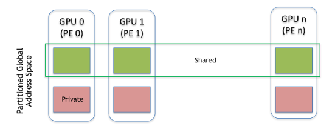
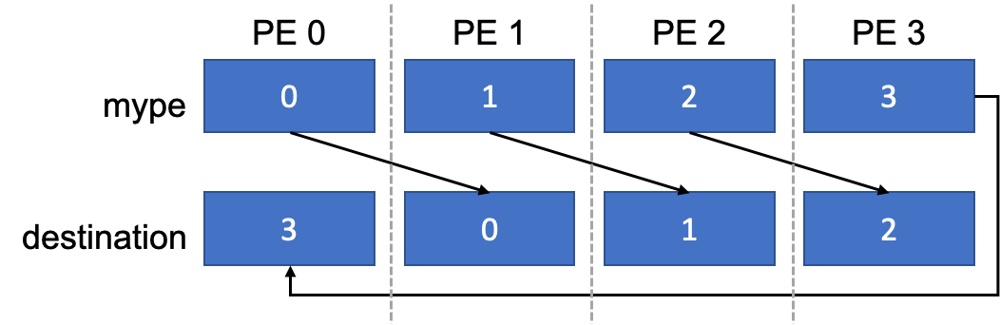

# Using NVSHMEM

An NVSHMEM job consists of several operating system processes, that are referred to as processing elements (PEs), and execute on one or more nodes in a GPU cluster. NVSHMEM jobs are launched by a process manager and each process in an NVSHMEM job runs a copy of the same executable program.

An NVSHMEM job represents a single program, multiple data (SPMD) parallel execution. Each PE is assigned an integer identifier (ID), that ranges from zero to one less than the total number of PEs. PE IDs are used to identify the source or destination process in OpenSHMEM operations and are also used by application developers to assign work to specific processes in an NVSHMEM job.

All PEs in an NVSHMEM job must simultaneously, i.e. collectively, call the NVSHMEM initialization routine before an NVSHMEM operation can be performed. Similarly, before exiting, PEs must also collectively call the NVSHMEM finalization function. After initialization, a PE’s ID and the total number of running PEs can be queried. PEs communicate and share data through symmetric memory that is allocated from a symmetric heap that is located in GPU memory. This memory is allocated by using the CPU-side NVSHMEM allocation API. Memory that is allocated by using any other method is considered private to the allocating PE and is not accessible by other PEs.

Shared and private memory regions at each PE. The aggregation of the shared memory segments across all PEs is referred to as a Partitioned Global Address Space (PGAS).

Symmetric memory allocation in NVSHMEM is a collective operation that requires each PE to pass the same value in the size argument for a given allocation. The resulting memory allocation is symmetric; a linear region of memory of the specified size is allocated from the symmetric heap of each PE and can subsequently be accessed by using a combination of the PE ID and the symmetric address that is returned by the NVSHMEM allocation routine. Symmetric memory is accessible to all other PEs in the job by using NVSHMEM APIs from CUDA kernels and on the CPU. In addition, the symmetric address that is returned by an NVSHMEM allocation routine is also a valid pointer to local GPU memory on the calling PE and can be used by that PE to directly access its portion of a symmetric allocation directly by using CUDA APIs and the load/store operations on the GPU.

Similar to all PGAS models, the location of data in the global address space is an inherent part of the NVSHMEM addressing model. NVSHMEM operations access symmetric objects in terms of the `<symmetric_address, destination_PE>` tuple. The symmetric address can be generated by performing pointer arithmetic on the address that is returned by an NVSHMEM allocation routine, for example `&X[10]` or `&ptr->x`. Symmetric addresses are only valid at the PE where they were returned by the NVSHMEM allocation routine and cannot be shared with other PEs. In the NVSHMEM runtime, symmetric addresses are translated to the actual remote address, and advanced CUDA memory mapping techniques are used to ensure this translation can be completed with minimal overhead.

## Example NVSHMEM Program

The code snippet below shows a simple example of NVSHMEM usage within a CUDA kernel where PEs form a communication ring.

    #include <stdio.h>
    #include <cuda.h>
    #include <nvshmem.h>
    #include <nvshmemx.h>

    __global__ void simple_shift(int *destination) {
        int mype = nvshmem_my_pe();
        int npes = nvshmem_n_pes();
        int peer = (mype + 1) % npes;

        nvshmem_int_p(destination, mype, peer);
    }

    int main(void) {
        int mype_node, msg;
        cudaStream_t stream;

        nvshmem_init();
        mype_node = nvshmem_team_my_pe(NVSHMEMX_TEAM_NODE);
        cudaSetDevice(mype_node);
        cudaStreamCreate(&stream);

        int *destination = (int *) nvshmem_malloc(sizeof(int));

        simple_shift<<<1, 1, 0, stream>>>(destination);
        nvshmemx_barrier_all_on_stream(stream);
        cudaMemcpyAsync(&msg, destination, sizeof(int), cudaMemcpyDeviceToHost, stream);

        cudaStreamSynchronize(stream);
        printf("%d: received message %d\n", nvshmem_my_pe(), msg);

        nvshmem_free(destination);
        nvshmem_finalize();
        return 0;
    }

This example begins in main by initializing the NVSHMEM library, querying the PE’s ID in the on-node team, and using the on-node ID to set the CUDA device. The device must be set before you allocate memory or launch a kernel. A stream is created and a symmetric integer called `destination` is allocated on every PE. Finally, the `simple_shift kernel` is launched on one thread with a pointer to this symmetric object as its argument.

Illustration of the communication performed by the simple_shift kernel.

This kernel queries the global PE ID and the number of executing PEs. It then performs a single-element integer put operation to write the calling PE’s ID into `destination` at the PE with the next highest ID, or in the case of the PE with the highest ID, 0. The kernel is launched asynchronously on stream, followed by an NVSHMEM barrier on the stream to ensure that all updates have completed, and an asynchronous copy to copy the updated `destination` value to the host. The stream is synchronized and the result is printed. Here is the sample output with 8 PEs:

    0: received message 7
    1: received message 0
    2: received message 1
    4: received message 3
    6: received message 5
    7: received message 6
    3: received message 2
    5: received message 4

Finally, the `destination` buffer is freed and the NVSHMEM library is finalized before the program exits.

## Using GPUDirect Async Kernel-Initiated Communication

NVSHMEM supports implementing both the control plane and data plane of InfiniBand network communications fully in the GPU, removing the need to reverse-proxy device-initiated communications. This feature-set is named GPUDirect Async Kernel-Initiated (GDAKI) and is exposed

>   1. through the InfiniBand GPUDirect Async (IBGDA) remote transport, and
>   2. through the GPUNetIO remote transport with GDAKI enabled.
>

Both transports have the following prerequisites:

>   * Only Mellanox HCAs and NICs.
>   * Mellanox OFED 5.0 or newer.
>   * nvidia.ko >= 510.40.3
>   * At least one of the following prerequisites: * DMA-BUF support (via OpenRM, requires Linux kernel >= 6.1) * nvidia_peermem >= 510.40.3 * nv_peer_mem >= 1.3
>

The GPUNetIO transport optionally depends on the DOCA SDK to enable advanced NIC features such as Data Direct Placement (DDP). The DOCA SDK path can be specified using the DOCA_SDK_LIB_PATH environment variable. The minimum required version of the DOCA SDK is 3.4. For details, refer to the GPUNetIO documentation.

Further information on IBGDA and GPUNetIO with environment variables affecting that transport can be found in the Environment Variables section of these documents.

## Using NVSHMEM With MPI or OpenSHMEM

NVSHMEM can be used with OpenSHMEM or MPI, which makes it easier for existing OpenSHMEM and MPI applications to be incrementally ported to use NVSHMEM. The following code snippet shows how NVSHMEM can be initialized in an MPI program. In this program, we assume that each MPI process is also an NVSHMEM PE, where each process has both an MPI rank and an NVSHMEM rank.

    #include <cuda.h>
    #include <nvshmem.h>
    #include <nvshmemx.h>
    #include <mpi.h>

    int main(int argc, char *argv[]) {
        int rank, ndevices;

        nvshmemx_init_attr_t attr;
        MPI_Comm comm = MPI_COMM_WORLD;
        attr.mpi_comm = &comm;

        MPI_Init(&argc, &argv);
        MPI_Comm_rank(MPI_COMM_WORLD, &rank);

        cudaGetDeviceCount(&ndevices);
        cudaSetDevice(rank % ndevices);
        nvshmemx_init_attr(NVSHMEMX_INIT_WITH_MPI_COMM, &attr);

        // ...

        nvshmem_finalize();
        MPI_Finalize();
        return 0;
    }

As shown in this example, the MPI (or OpenSHMEM) library should be initialized first. After MPI is initialized, the MPI rank can be queried and used to set the CUDA device. An `nvshmemx_init_attr_t` structure is created and the `mpi_comm` field is assigned a reference to an MPI communicator handle. To enable MPI compatibility mode, the `nvshmemx_init_attr` operation is used instead of `nvshmem_init`. See nvshmemx_init_attr for additional details.

## Compiling NVSHMEM Programs

Once an application has been written, it can be compiled and linked to NVSHMEM with `nvcc`.

NVSHMEM also supplies cmake config files in the default location of all installed packages. Cmake toolchains can use the cmake `find_package()` utility in config mode to build with nvshmem.

There are some references to more complex build environments in Troubleshooting And FAQs.

The NVSHMEM library installation consists of two directories, `lib` and `include`. `lib` contains the shared library `libnvshmem_host.so`; the static archive `libnvshmem_device.a`; and the NVSHMEM bootstrap modules. The `include` directory contains all of the NVSHMEM headers. An example like the first one above can be compiled and linked with the NVSHMEM library using the following command, assuming the source file is `nvshmem_hello.cu` and the NVSHMEM library installation path is `NVSHMEM_HOME`.

    nvcc -rdc=true -ccbin g++ -gencode=$NVCC_GENCODE -I $NVSHMEM_HOME/include nvshmem_hello.cu -o nvshmem_hello.out -L $NVSHMEM_HOME/lib -lnvshmem_host -lnvshmem_device

`NVCC_GENCODE` is an nvcc option to specify which GPU archtecture to build the code for. more information on that option can be found at https://docs.nvidia.com/cuda/cuda-compiler-driver-nvcc/index.html.

If NVSHMEM was built with UCX support, the following additional flags are required.

    -L$(UCX_HOME)/lib -lucs -lucp

If NVSHMEM was built with IBDEVX, IBGDA, or GPUNetIO support, the following additional flag is required.

    -L$(NON_STANDARD_MLX5_LOCATION) -lmlx5

## Running NVSHMEM Programs

By default, the NVSHMEM library compiles with support for the PMI and PMI-2 interfaces. However, it can also be compiled with support for PMIx. Please see installation guide for more information on compiling the NVSHMEM libraries.

NVSHMEM applications can be directly executed by the mpirun launcher. There are no NVSHMEM-specific options or configuration files. For example, both of the following commands are valid ways of launching an NVSHMEM application.

    mpirun -n 4 -ppn 2 -hosts hostname1,hostname2 /path/to/nvshmem/app/binary
    mpirun -n 2 /path/to/nvshmem/app/binary

NVSHMEM applications can also be directly launched by srun without any additional configuration.

By default, NVSHMEM applications will try to communicate using PMI-1. However, the PMI interface used by the application can be modified at runtime by setting the `NVSHMEM_BOOTSTRAP_PMI` environment variable. This enables the same NVSHMEM binary to be run by multiple launchers using different PMI communication interfaces. More information on the `NVSHMEM_BOOTSTRAP_PMI` interface can be found in Environment Variables

NVSHMEM packages an installation script for the Hydra Process Manager at `scripts/install_hydra.sh` to enable standalone NVSHMEM application development. This eliminates any dependency on installing an external MPI to use NVSHMEM. Specifically, you can write an NVSHMEM program and run a multi-process job using the supplied Hydra Process Manager. The Hydra launcher installed from `scripts/install_hydra.sh` is called nvshmrun.hydra and installs a symbolic link, `nvshmrun` for easier access. Run `nvshmrun.hydra -h` after installation for help information.

## Communication Model

NVSHMEM provides _get_ and _put_ APIs, which copy data from and to symmetric objects, respectively. Bulk transfer, scalar transfer, and interleaved versions of these APIs are provided. In addition, Atomic Memory Operations (AMOs) are also provided and can be used to perform atomic updates to symmetric variables. On supported GPUs, NVSHMEM can use TMA for device-side point-to-point operations over peer-reachable GPU memory. See Using TMA with NVSHMEM for details on enabling and using this path. With these APIs, NVSHMEM provides fine-grained and low-overhead access to data that is stored in the PGAS from CUDA kernels. By performing communication from within the kernel, NVSHMEM also allows applications to benefit from the intrinsic latency-hiding capabilities of the GPU warp scheduling hardware.

In addition to put, get, and AMO library routines, applications can also use the `nvshmem_ptr` routine to query a direct pointer to data that is located in partitions of the PGAS on other PEs. When the memory at the specified PE is directly accessible, this function returns a valid pointer. Otherwise, it returns a null pointer. This allows applications to issue direct loads and stores to global memory. NVSHMEM APIs, and loads/stores when allowed by the hardware, can be used to access local and remote data, which allows one code path to handle both local and remote data. Similarly, applications can also use `nvshmemx_mc_ptr` routine to query a direct multicast pointer for any team to the data that is located in partitions of the PGAS. When the memory of the specified TEAM is directly accessible over platform that supports `CU_DEVICE_ATTRIBUTE_MULTICAST_SUPPORTED`, this function returns a valid pointer. Otherwise, it returns a null pointer. This allows applications to issue direct multimem load reduce and store broadcast to global multicast memory. Refer to multicast memory programming guide to know more about to allocate, publish and subscribe to multicast memory.

NVSHMEM provides the following notable extensions to the OpenSHMEM interfaces:

>   * All symmetric memory that is allocated using the NVSHMEM allocation APIs is pinned GPU device memory.
>   * NVSHMEM supports both GPU- and CPU-side communication and synchronization APIs, provided that the memory involved is GPU device memory allocated by NVSHMEM. In other OpenSHMEM implementations, these APIs can only be called from the CPU.
>

NVSHMEM is a stateful library and when the PE calls into the NVSHMEM initialization routine, it detects which GPU a PE is using. This information is stored in the NVSHMEM runtime. All symmetric allocation calls that are made by the PE return the device memory of the selected GPU. All NVSHMEM calls made by the PE are assumed to be made with respect to the selected GPU or from inside kernels launched on this GPU. This requires certain restrictions on PE-to-GPU mappings in applications when using NVSHMEM.

An NVSHMEM program should adhere to the following:

>   * The PE selects its GPU (with cudaSetDevice, for example), before the first allocation, synchronization, communication, collective kernel API launch call, or NVSHMEM API call on the device.
>   * An NVSHMEM allocation or synchronization must be performed on the host prior to the first NVSHMEM API call on the device.
>   * The PE uses one and only one GPU throughout the lifetime of an NVSHMEM job.
>   * A GPU cannot be used by more than one PE.
>

NVSHMEM relies on the data coalescing features in the GPU hardware to achieve efficiency over the network when the data access API is used. Application developers must follow CUDA programming best practices that promote data coalescing when using fine-grained communication APIs in NVSHMEM.

NVSHMEM also allows any two CUDA threads in a job to synchronize on locations in global memory by using the OpenSHMEM point-to-point synchronization API `nvshmem_wait_until` or collective synchronization APIs like `nvshmem_barrier`.

**Note** : CUDA kernels that use synchronization or collective APIs must be launched by using the collective launch API to guarantee deadlock-free progress and completion.

CUDA kernels that do not use the NVSHMEM synchronization or collective APIs, but use other NVSHMEM communication APIs, can be launched with the normal CUDA launch interfaces or the collective launch API. These kernels can still use other NVSHMEM device side APIs such as the one-sided data movement API.

An NVSHMEM program that uses collective launch and CUDA kernel-side synchronization APIs should adhere to the following guidelines guidelines for correctness, and **all** NVSHMEM programs should adhere to the following guidelines for performance predictability:

>   * Multiple PEs should not share the same GPU.
>   * NVSHMEM PEs should have exclusive access to the GPU. The GPU cannot be used to drive a display or for another compute job.
>

## Data Consistency

OpenSHMEM defines the consistency of data in the global address space in terms of ordering of operations and visibility of updates to symmetric objects.

NVSHMEM follows the OpenSHMEM memory model. However, several important exceptions are made to adapt OpenSHMEM to the weakly consistent memory model provided by the GPU architecture, as noted in Differences Between NVSHMEM and OpenSHMEM.

NVSHMEM provides the following methods to access local or remote symmetric memory:

>   * Remote memory access (RMA: PUT/GET)
>   * Atomic memory operations (AMO)
>   * Signal operations
>   * Direct load and store operations (for example, using a pointer that was returned by `nvshmem_ptr`)
>   * Direct multimem load reduce and store broadcast operations (for example, using a pointer that was returned by `nvshmemx_mc_ptr`)
>   * Collective functions (broadcast, reductions, and others)
>   * Wait and test functions (local symmetric memory only)
>

Two operations that were issued by the same PE or different PEs, and that access the same memory location in parallel, are in conflict when one or more of the operations performs a write. These conflicts result in undefined behavior in the OpenSHMEM memory model. An exception is made when the operations are a combination of AMOs or AMOs and wait/test operations. A second exception is made when the operations are a combination of signal updates and wait/test operations.

Updates to globally accessible objects are unordered. A PE can enforce the ordering of its updates with respect to accesses performed by the target PE using the `nvshmem_fence` operation. When updates performed by a PE must be ordered or made visible to PEs other than the target PE, use the `nvshmem_quiet` operation. While updates are unordered, updates made by using NVSHMEM APIs are guaranteed to eventually complete without any additional actions performed by the source or the target PE. As a result, NVSHMEM guarantees that updates will eventually become visible to other PEs through the NVSHMEM API. Updates are also stable in the sense that after the update is visible to another API call, the update remains until replaced by another update. This guarantees that synchronization as described above completes in a finite amount of time.

By default, all OpenSHMEM operations are unordered and the programmer must ensure ordering by using `nvshmem_fence` and `nvshmem_quiet` operations to order memory updates and wait/test operations to order memory reads. Barrier operations can also be used to order updates and reads. The following list provides additional detail on scenarios where two memory accesses by the same PE are guaranteed to occur in order:

>   * The accesses are the result of different collective function calls that happen in program order.
>   * The first access is a wait or test call that is followed by a read operation and both operations target local symmetric memory.
>   * The accesses are the result of two different API calls or LD/ST operations and are separated by an appropriate ordering operation based on the following table:
>

**Type of first access** | **Same target PE** | **Different target PE**
---|---|---
Blocking | Fence/quiet/barrier | Quiet/barrier
Non-blocking | Quiet/barrier | Quiet/barrier

The `nvshmem_quiet` operation is used to complete pending operations, and provides the following guarantees:

>   * All non-blocking operations issued by the calling PE have completed.
>   * Access to all PEs (for example, to any location in the PGAS) are ordered, so accesses that occurred before the quiet operation can be observed by all PEs as having occurred before accesses after the quiet operation. PEs must use appropriate synchronization operations, for example, wait/test operations, to observe the ordering enforced at the PE that performed the quiet operation.
>   * Ordering is guaranteed for all OpenSHMEM APIs and for direct store operations.
>

The `nvshmem_fence` operation provide the following weaker guarantees and is used to ensure the point-to-point ordering of operations:

>   * Access to each PE (for example, to a partition of the PGAS) are ordered, so that accesses that occurred before the fence operation can be observed by the PE that is local to the corresponding partition of the PGAS as having occurred before accesses after the fence operation. PEs must use appropriate synchronization operations, for example, wait/test operations, to observe the ordering enforced at the PE that performed the quiet operation.
>   * Ordering is guaranteed for all OpenSHMEM APIs, and for direct store operations.
>

## Multiprocess GPU Support

Until NVSHMEM version 2.2.1, NVSHMEM supported only one PE per GPU. Since NVSHMEM 2.4.1, limited support for multiple PEs per GPU (MPG) is available. MPG support depends on whether the application is being run with or without CUDA MPS (Multi-process Service). MPS documentation is available here. Three scenarios can be considered for MPG support.

  1. MPG without MPS

Multiple PEs can use the same GPU by time-sharing. Each PE has a CUDA context associated with it. GPU must switch contexts to run CUDA tasks from different PEs. Since multiple PEs cannot simultaneously run on the same GPU, support for point-to-point synchronization API and collectives API is not available. Following API support is available in this scenario:

     1. Point-to-point RMA API
     2. `nvshmem_barrier_all()` host API
     3. `nvshmemx_barrier_all_on_stream()`
     4. `nvshmem_sync_all()` host API
     5. `nvshmemx_sync_all_on_stream()`
  2. MPG with MPS

The Multi-process Service (MPS) allows multiple CUDA contexts to run simultaneously on the same GPU. This makes it possible to support NVSHMEM’s synchronization and collectives API as well provided that the sum of the active thread percentage of all the PEs running on the same GPU adds up to be less than 100. In this scenario, support for all NVSHMEM API is available. Details on how to set the active thread percentage for a MPS client process can be found in the MPS documentation.

  3. MPG with MPS and oversubscription

When the sum of active thread percentages of the PEs running on the same GPU adds up to be more than 100, only the limited API support in the MPG without MPS scenario is available. This is because in this scenario, CUDA cannot guarantee that all PEs assigned to the same GPU can simultaneously run on the GPU thus potentially leading to deadlock in point-to-point synchronization and collectives API.

## Building NVSHMEM Applications/Libraries

NVSHMEM is built as two libraries - `libnvshmem_host.so` and `libnvshmem_device.a`. An application must link both the libraries even if it is using only the host API or the device API.

When building a shared library that uses NVSHMEM, the static library `libnvshmem_device.a` will get integrated into the shared library. An application that uses this library may in turn also use NVSHMEM or link another library that uses NVSHMEM. This can lead to multiple device library instances and hence symbol conflicts. Therefore, the shared library must hide the NVSHMEM symbols by exposing only its own API. It can use linker scripts for this purpose.
